<p align="center">
  
</p>

<p align="center">
  <b>English</b> · <a href="README_zh.md">中文</a>
</p>

Six post-training methods for a multimodal LLM in about 2,000 lines of Python: `pt`,
`sft`, `dpo`, `grpo`, `opd` (on-policy distillation) and `opd-rl`. One flat `Config`,
one training loop, one file per method.

- 20 files, one dataclass for configuration, bare `assert`s instead of a validation
  layer, no logging setup.
- Every stage answers the same three questions (`micro_batches` / `denom` / `loss`),
  so `loop.py` contains no `if stage == ...`.
- `--dry-run` swaps in a small random model but keeps the real vocabulary and the real
  token ids, so the whole pipeline runs on CPU.

## Dataflow

```mermaid
flowchart LR
    J[("jsonl row")] --> T["template.py<br/>chat template · images · mask"]
    T --> D["dataset.py<br/>shuffle · pack · shard"]
    D --> C["collate.py<br/>padded / padding-free · M-RoPE"]
    C --> H["model.py<br/>Policy.hidden()"]
    H --> LP["logprobs.py<br/>chunked lm_head"]
    LP --> S["stages/*.py<br/>denom + loss"]
    S --> L["loop.py<br/>accumulate · clip · step"]

    subgraph RL["rl/ — on-policy stages only"]
        direction LR
        RO["rollout.py<br/>generate (HF / vLLM)"] --> RW["reward.py<br/>rule rewards"]
        RW --> AD["advantage.py<br/>group baseline"]
        AD --> PL["loss.py<br/>clipped surrogate"]
    end

    L -.->|"grpo · opd-rl"| RO
    PL -.-> S
```



The main chain is the same for every stage. `rl/` is entered only by the stages that
generate their own training data, and it rejoins the chain at the per-token loss.

## Stages

| stage | in one line | teacher | ref | rollout |
|---|---|---|---|---|
| `pt` | every token supervised, no template, no roles | – | – | – |
| `sft` | only the assistant turns, images included | – | – | – |
| `dpo` | four sequence log-probs, no sampling, no reward model | – | only `--tuner full` | – |
| `grpo` | the group's mean reward is the baseline, no critic | – | only `--kl-coef != 0` | ✓ |
| `opd` | the KL is the loss: student writes, teacher grades | ✓ | – | `--on-policy-ratio > 0` |
| `opd-rl` | teacher log-ratio enters the per-token advantage | ✓ | only `--kl-coef != 0` | ✓ |

`cli.build_all` decides once which of these collaborators exist, so `stages/` can assert
they are there instead of checking for `None`, and an SFT run never allocates a second
copy of the weights.

`opd` differentiates the divergence; `opd-rl` turns `log p_T - log p_S` into a per-token
reward inside GRPO's advantage. They share the rollout, the top-k support and the loss
aggregation, so switching between them is one flag.

## Install

```bash
pip install -e .          # or: pip install -r requirements.txt
```

`torch`, `transformers`, `peft`, `pillow`. `vllm` is only needed for `--rollout vllm`,
`mathruler` only for `--reward-funcs math`.

Any checkpoint whose config says `model_type: qwen3_5` works, as a local directory or a
hub id:

```bash
huggingface-cli download Qwen/Qwen3.5-4B --local-dir ./Qwen3.5-4B
export MODEL=./Qwen3.5-4B
```

## Quick start

```bash
python3 -m nanotrainllm.cli --dry-run --stage sft \
    --model "$MODEL" --data examples/data/sft.jsonl
```

`--dry-run` reads the checkpoint's config and processor but never its weights: it builds
a small random model on CPU and runs two real steps. Checking a new dataset, a new
reward function or a template change starts here.

All six stages, one step each:

```bash
M="--model $MODEL --dry-run --max-steps 1"
python3 -m nanotrainllm.cli $M --stage pt     --data examples/data/pt.jsonl
python3 -m nanotrainllm.cli $M --stage sft    --data examples/data/sft.jsonl
python3 -m nanotrainllm.cli $M --stage dpo    --data examples/data/dpo.jsonl  --micro-batch-size 2
python3 -m nanotrainllm.cli $M --stage grpo   --data examples/data/grpo.jsonl --num-generations 2
python3 -m nanotrainllm.cli $M --stage opd    --data examples/data/sft.jsonl  --teacher "$MODEL"
python3 -m nanotrainllm.cli $M --stage opd-rl --data examples/data/grpo.jsonl --teacher "$MODEL" \
    --num-generations 2
```

DPO needs `--micro-batch-size 2`: a preference pair has to live inside one forward pass.
`examples/` holds one script per method, and each header explains why its flags have
those values and which combinations an `assert` refuses.

CLI flags are generated from `Config`'s fields, so adding a knob never touches argparse.
The eight fields filled in from the checkpoint or the launcher (`hf_config`, `rank`,
`pad_token_id`, …) are deliberately not exposed.

## Limitations

- One model family: `build_model` asserts `model_type == "qwen3_5"`.
- Rule rewards only, no reward model.
- `--dry-run` cannot cover `--rollout vllm` (needs a GPU) or `--packing` /
  `--padding-free` (needs a varlen flash-attention kernel; under sdpa the full-attention
  layers would attend across sample boundaries).
- No resume, no EMA, no tracker integration. `Trainer.run()` returns its history as data.

MIT, see [LICENSE](LICENSE). Conventions in [CONTRIBUTING.md](CONTRIBUTING.md).
