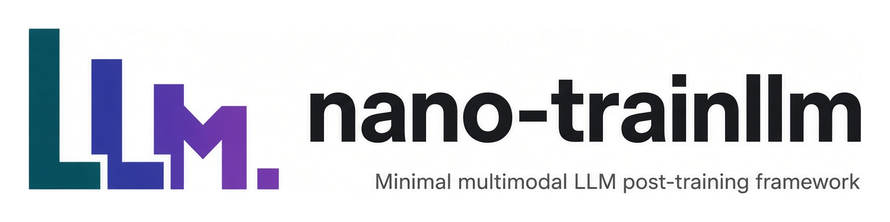
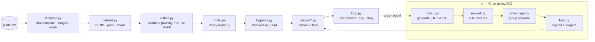

<p align="center">
  
</p>

<p align="center">
  <a href="README.md">English</a> · <b>中文</b>
</p>

约 2000 行 Python，多模态大模型的六种后训练方法：`pt`、`sft`、`dpo`、`grpo`、
`opd`（on-policy distillation）与 `opd-rl`。一个扁平的 `Config`，一个训练循环，
一种方法一个文件。

- 20 个文件，一个 dataclass 管配置，用裸 `assert` 代替校验层，不配 logging。
- 每个 stage 只回答同样的三个问题（`micro_batches` / `denom` / `loss`），所以 `loop.py` 里
  没有一处 `if stage == ...`。
- `--dry-run` 换成随机初始化的小模型，但词表和 token id 都是真的，整条流水线在 CPU 上跑得通。

## 数据流



主链对每个 stage 都一样。`rl/` 只有自己生成训练数据的 stage 才会进，并在 per-token 损失处
汇回主链。

## 六个阶段

| stage | 一句话 | teacher | ref | rollout |
|---|---|---|---|---|
| `pt` | 每个 token 都算 loss，没有模板也没有角色 | – | – | – |
| `sft` | 只监督 assistant 轮，图片算在里面 | – | – | – |
| `dpo` | 四个序列 log-prob，不采样，不要奖励模型 | – | 仅 `--tuner full` | – |
| `grpo` | 用组内平均奖励当 baseline，不要 critic | – | 仅 `--kl-coef != 0` | ✓ |
| `opd` | KL 就是 loss：学生写，老师批 | ✓ | – | `--on-policy-ratio > 0` |
| `opd-rl` | 老师的 log 比值进入 per-token 优势 | ✓ | 仅 `--kl-coef != 0` | ✓ |

`cli.build_all` 一次性决定哪些协作者会被构造出来，于是 `stages/` 可以 assert 它们存在而不必
判 `None`，一次普通的 SFT 也不必为第二份权重付内存。

`opd` 对散度求导；`opd-rl` 把 `log p_T - log p_S` 变成 GRPO 优势里的 per-token 奖励。两者共用
rollout、共用 top-k 支撑集、共用损失聚合，切换只是换一个 flag。

## 安装

```bash
pip install -e .          # 或：pip install -r requirements.txt
```

`torch`、`transformers`、`peft`、`pillow`。`vllm` 只有 `--rollout vllm` 需要，
`mathruler` 只有 `--reward-funcs math` 需要。

任何 config 里 `model_type: qwen3_5` 的 checkpoint 都能用，本地目录或 hub id 都行：

```bash
huggingface-cli download Qwen/Qwen3.5-4B --local-dir ./Qwen3.5-4B
export MODEL=./Qwen3.5-4B
```

## 快速开始

```bash
python3 -m nanotrainllm.cli --dry-run --stage sft \
    --model "$MODEL" --data examples/data/sft.jsonl
```

`--dry-run` 读 checkpoint 的 config 和 processor，但不读权重：它在 CPU 上另建一个小的随机
模型，跑两个真实的 step。换数据集、换奖励函数、改模板都从这里开始。

六个阶段各跑一步：

```bash
M="--model $MODEL --dry-run --max-steps 1"
python3 -m nanotrainllm.cli $M --stage pt     --data examples/data/pt.jsonl
python3 -m nanotrainllm.cli $M --stage sft    --data examples/data/sft.jsonl
python3 -m nanotrainllm.cli $M --stage dpo    --data examples/data/dpo.jsonl  --micro-batch-size 2
python3 -m nanotrainllm.cli $M --stage grpo   --data examples/data/grpo.jsonl --num-generations 2
python3 -m nanotrainllm.cli $M --stage opd    --data examples/data/sft.jsonl  --teacher "$MODEL"
python3 -m nanotrainllm.cli $M --stage opd-rl --data examples/data/grpo.jsonl --teacher "$MODEL" \
    --num-generations 2
```

DPO 需要 `--micro-batch-size 2`：一对偏好样本要落在同一次 forward 里。`examples/` 里一种方法
一个脚本，每个脚本的头部注释说明它的参数为什么是这个值，以及哪些组合会被 `assert` 拒绝。

CLI 的 flag 是从 `Config` 的字段生成的，加一个旋钮不用碰 argparse。八个由 checkpoint 或启动器
填入的字段（`hf_config`、`rank`、`pad_token_id` …）故意不暴露。

## 局限

- 只支持一个模型系列：`build_model` 断言 `model_type == "qwen3_5"`。
- 只有规则奖励，没有奖励模型。
- `--dry-run` 到不了 `--rollout vllm`（要 GPU）和 `--packing` / `--padding-free`（要 varlen 的
  flash-attention kernel；sdpa 下全注意力层会跨样本边界）。
- 没有 resume，没有 EMA，不接追踪器。`Trainer.run()` 把历史作为数据返回。

MIT，见 [LICENSE](LICENSE)。约定见 [CONTRIBUTING.md](CONTRIBUTING.md)。
